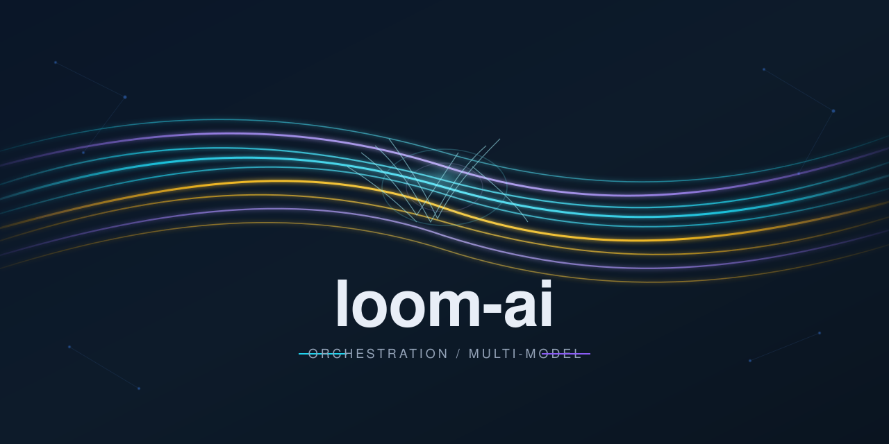

# loom-ai



Pluggable AI orchestration framework with swappable backends. Zero required dependencies.

## Architecture

See [docs/architecture.md](docs/architecture.md) for detailed architecture documentation, including the extension model, request lifecycle, and implementation boundaries.

Loom is an orchestration substrate built around provider-neutral contracts. The core defines stable interfaces; external projects and services may implement those contracts without becoming Loom dependencies.

```text
                         Loom Core
                            |
             +--------------+--------------+
             |              |              |
        Agent Runtime   Context Engine  Capabilities
             |              |              |
       Goose / native   Headroom /      MCP / native /
       / other agents   native Loom     external tools
             |              |              |
             +--------------+--------------+
                            |
                     Model Providers
              Claude / OpenAI / Gemini /
              Nemotron / Nex-N2 / local
                            |
                    Evaluation Engines
               Loom / G0DM0D3 / Agent Island
```

### Pluggability principles

- **Model Provider** — interchangeable inference/model endpoints.
- **Agent Runtime** — interchangeable agent execution environments.
- **Context Engine** — interchangeable context construction, compression, and cache-aware middleware.
- **Capability/Tool Backend** — interchangeable native, MCP, and external tool implementations.
- **Evaluation Engine** — interchangeable evaluation, ranking, tournament, and benchmark systems.
- **Storage, Queue, Secrets, Embedding, Search, Graph, and Task Runner** remain independently replaceable backends.

External projects are **interoperability targets and implementations**, not architectural dependencies. Loom should define the contract first and validate it against multiple implementations.

This distinction is intentional: Loom can **use** an external project without incorporating it, and can **assimilate** an architectural idea without making the source project a dependency.

## Install

```bash
pip install flossware-loom-ai              # core (stdlib only)
pip install flossware-loom-ai[server]      # + FastAPI REST server
pip install flossware-loom-ai[postgresql]  # + PostgreSQL/pgvector storage
pip install flossware-loom-ai[redis]       # + Redis queues
pip install flossware-loom-ai[all]         # everything
```

## Quick Start

```python
from loom_ai import LoomConfig, Document

cfg = LoomConfig.from_env()
await cfg.storage.store_document(
    Document(id="doc-1", title="Example", content="Hello world")
)

result = await cfg.consensus.synthesize(
    "Explain distributed systems",
    models=["gemini-3.5-flash", "llama-3.3-70b", "mistral-small"],
)
print(result.synthesis.content)
```

## Protocol Contracts

Loom defines **78 `@runtime_checkable` Protocol contracts** across 10 phases (35 stable, 43 experimental), all using structural subtyping (no ABC inheritance required). The recommended import path is `from loom_ai.contracts import ...` which re-exports every contract through a single stable facade. See [docs/contracts.md](docs/contracts.md) for the full inventory.

### Core Protocols (`protocols.py`)

| Protocol | Purpose | Default Backend |
|----------|---------|-----------------|
| `StorageBackend` | Documents, chunks, embeddings | In-memory dicts |
| `QueueBackend` | Named task queues | In-memory deque |
| `SecretsBackend` | API keys and config | `os.environ` |
| `EmbeddingBackend` | Text to vectors | Zero vectors |
| `SearchBackend` | Full-text + semantic | Substring + cosine |
| `GraphBackend` | Knowledge graph | In-memory adjacency |
| `LLMBackend` | Chat completions | HTTP (OpenAI-compatible) |
| `ToolProvider` | MCP-shaped tool contract | In-memory callables |
| `ResourceProvider` | MCP-shaped resource contract | In-memory static |
| `TaskRunner` | Task execution strategy | Noop (pass-through) |
| `IdempotentStore` | Upsert semantics marker | All storage backends |

### Phase 1–3: Orchestration Contracts (20 contracts)

Structured output, conversation, memory, model routing, consensus patterns, knowledge/RAG, streaming, workflow, learning, strategy selection, budget tracking, transcripts, resilience (circuit breaker), observability, session management, worker registry, caching, evaluation, feedback loops, and human-in-the-loop.

### Phase 4–9: Advanced Contracts (47 contracts)

Knowledge graphs, temporal stores, belief management, evaluation suites, telemetry, inference routing, agent lifecycle, agent memory, output validation, security gates, program optimization, agent loops, recipe execution, ACP interoperability, context assembly, trajectory stores, agent environments, provider/capability/policy registries, catalog synchronization, tournament runners, consensus strategies, model evaluation, context compression, prompt cache optimization, pluggable runtimes, health checks, and request validation.

### REST API Contracts (`contracts_api.py`)

Request lifecycle, error handling, and middleware protocols.

## Backend Implementations

36 pluggable backend modules in `loom_ai/backends/`:

| Backend | Purpose |
|---------|---------|
| `adaptive_router` | Thompson Sampling model routing |
| `adversarial` | Independent model panel verification |
| `consensus_strategies` | Majority vote, weighted, quality threshold |
| `fleet` | Worker pool + 3 load-balancing strategies |
| `genetic_optimizer` | GA-based strategy parameter optimization |
| `graph` | In-memory knowledge graph with BFS/DFS |
| `postgresql` | PostgreSQL + pgvector storage/search |
| `provider_health` | Health tracking, rate limiting, circuit breaker |
| `rag` | Document ingestion, embeddings, hybrid search |
| `redis_queue` | Durable queue with priorities, leases, DLQ |
| `security` | Config validation, secret masking, audit logging |
| `task_classifier` | Rule-based task classification + blueprints |
| `telemetry` | Execution telemetry, cost tracking, model feedback |

See `examples/demo.py` for a runnable walkthrough using in-memory backends.

## Multi-Model Consensus

```python
from loom_ai import ChatMessage, LoomConfig

cfg = LoomConfig.from_env()

result = await cfg.consensus.synthesize(
    "Check this code for bugs",
    models=["gemini-3.5-flash", "llama-3.3-70b", "codestral"],
    arbiter_model="gemini-3.5-flash",
    tool_name="review",
    arbiter_temperature=0.3,
)
print(result.synthesis.content)

responses, failed = await cfg.consensus.gather(
    [ChatMessage(role="user", content="Check this code for bugs")],
    models=["gemini-3.5-flash", "llama-3.3-70b", "codestral"],
)
```

The arbiter uses the same configured deadline/retry policy as worker calls and returns successful worker responses when synthesis cannot be completed.

## License

Apache 2.0
